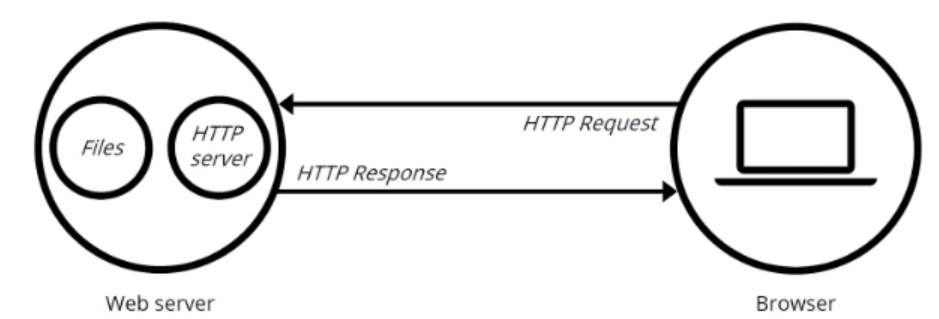

# Web Server

Linux下C++轻量级Web服务器，助力初学者快速实践网络编程，搭建属于自己的服务器.

- 使用**线程池 + epoll(ET和LT均实现) + 模拟Proactor模式**的并发模型
- 使用**状态机**解析HTTP请求报文，支持解析**GET和POST**请求
- 通过访问服务器数据库实现web端用户**注册、登录**功能，可以请求服务器**图片和视频文件**
- 实现**同步/异步日志系统**，记录服务器运行状态
- 经Webbench压力测试可以实现**上万的并发连接**数据交换

  webserver就是一个服务器软件，主要功能是通过Http协议和客户端（浏览器）进行通信，浏览器向服务器请求资源，服务器响应请求返回对应文件或者Error信息。



首先通过TCP协议与目标服务器进行三次握手连接，然后HTTP协议生成针对于服务器的HTTP报文，通过TCP、IP等协议发送到Web服务器上。

#### HTTP请求报文：


#### HTTP响应报文：


## 服务器基本框架：


#### Reactor模式：

  使用多reactor多线程模式：主线程负责监控事件，当有事件发生时，获取连接，把连接交给子线程进行进一步监听处理。同步IO。

#### Proactor模式：

当有新的IO事件发生时,由操作系统进行处理,不需要像reactor模式自己调用read等读写数据,当内核读写好数据后,会通知应用程序处理数据.


## 线程池：

由服务器预先创建的一组子线程，其创建的数量应该和CPU数量差不多。线程池是一组静态资源，处理数据后无需销毁线程。  当工作队列有数据时，调用随机算法取出子线程进行处理。


1.子线程共享工作队列的资源。需要线程同步：顺序执行，采取互斥锁机制。

半同步/半反应堆工作流程（以Proactor模式为例）

> - 主线程充当异步线程，负责监听所有socket上的事件
> - 若有新请求到来，主线程接收之以得到新的连接socket，然后往epoll内核事件表中注册该socket上的读写事件
> - 如果连接socket上有读写事件发生，主线程从socket上接收数据，并将数据封装成请求对象插入到请求队列中
> - 所有工作线程睡眠在请求队列上，当有任务到来时，通过竞争（如互斥锁）获得任务的接管权

2.条件变量类：

1. 互斥量用于保护对共享资源的访问，确保一次只有一个线程可以访问共享资源。
2. 条件变量用于在特定条件满足时等待和唤醒线程。
3. 线程在等待条件变量时会释放互斥量的锁，并在条件满足时重新获取锁，与互斥量搭配使用。

3.信号量类：

`sem_wait`是一个用于等待信号量的函数，通过对信号量进行操作来实现线程之间的同步和互斥。

自动处理竞争条件，确保线程在等待期间的正确同步。它适用于控制对共享资源的访问，限制并发线程的数量，或实现其他需要同步的场景。

##### 线程池：

属性：

1.请求队列

2.请求队列中最多的请求数量

3.互斥锁

4.线程数量和线程池数组

5.信号量：判断是否有任务需要处理

6.结束线程

函数：

1.构造函数和析构函数

线程分离（pthread_detach）：设置为分离状态的线程在其执行结束后会自动释放其资源，包括线程的内存空间和其他相关资源

2.添加请求

队列中添加任务

#### EPOLLONESHOT事件：

因为一个socket连接在任意时刻只能被一个线程处理，即使是ET模式，在并发模式下，可能会导致多个线程同时操作同一个socket连接。作用是只能触发一次，所以需要使用epollctl再次注册。

```c++
struct epoll_event event;
event.events = EPOLLIN | EPOLLRDHUP;//对端断开连接时，内核会触发一个 EPOLLIN 事件，并设置 EPOLLRDHUP 标志，以通知应用程序对端关闭了连接。不需要之前的需要recv来读取判断是否断开连接。
epoll_ctl(epoll_fd, EPOLL_CTL_ADD, sockfd, &event);
```

#### 边缘触发模式：

保证得到通知后所有数据全部读出，套接字操作默认是阻塞的，设置非阻塞。	

```c++
int flag = func1(fd,F_GETFL,0);
func1(fd,F_SETFL,flag|O_NONBLOCK);
```

函数recv：

```c++
#include <sys/types.h>
#include <sys/socket.h>

ssize_t recv(int sockfd, void *buf, size_t len, int flags);
如果成功接收到数据，返回接收到的字节数。
如果连接已关闭，返回 0。
如果发生错误，返回 -1，并设置 errno
```

#### 有限状态机：

根据获取的不同的状态去执行不同的功能函数。

HTTP按照行去解析，

1.解析客户端请求时，主状态机的状态：请求行、头部字段、请求体。

根据解析行的不同状态去判断解析什么状态。

2.从状态机：读取到完整的行、行出错、行数据不完整。

```c++
    enum LINE_STATUS {
        LINE_OK = 0,
        LINE_BAD,
        LINE_OPEN
    };
```


**从状态机负责读取报文的一行，主状态机负责对该行数据进行解析**，主状态机内部调用从状态机，从状态机驱动主状态机。


### 解析报文process_read：

1.从状态机解析:parse_line()：将每一行的末尾\r\n符号改为\0\0，以便于主状态机直接取出对应字符串进行处理。

2.主状态机解析：

2.1 CHECK_STATE_REQUESTLINE           ：parse_request_line(char *text)

- 主状态机的初始状态，调用parse_request_line函数解析请求行

- 解析函数从m_read_buf中解析HTTP请求行，获得请求方法、目标URL及HTTP版本号

- 解析完成后主状态机的状态变为CHECK_STATE_HEADER

  对行进行解析，当解析出 GET/POST  URL  Version 则进入下一状态。

2.2 CHECK_STATE_HEADER                     ：parse_headers(char *text)

##### 在报文中，请求头和空行的处理使用的同一个函数，这里通过判断当前的text首位是不是\0字符，若是，则表示当前处理的是空行，若不是，则表示当前处理的是请求头。

- 调用parse_headers函数解析请求头部信息
- 判断是空行还是请求头，若是空行，进而判断content-length是否为0，如果不是0，表明是POST请求，则状态转移到CHECK_STATE_CONTENT，否则说明是GET请求，则报文解析结束。
- 若解析的是请求头部字段，则主要分析connection字段，content-length字段，其他字段可以直接跳过，各位也可以根据需求继续分析。
- connection字段判断是keep-alive还是close，决定是长连接还是短连接
- content-length字段，这里用于读取post请求的消息体长度


c语言字符串解释符：

```c++
//lulong\0heollo  :text
char* s = text;
s :  lulong\0
```

请求报文格式：


响应报文格式：


 **http报文处理流程**

  浏览器端发出http连接请求，主线程创建http对象接收请求并将所有数据读入对应buffer，将该对象插入任务队列，工作线程从任务队列中取出一个任务进行处理。

工作线程取出任务后，调用process_read函数，通过主、从状态机对请求报文进行解析。

解析完之后，跳转do_request函数生成响应报文，通过process_write写入buffer，返回给浏览器端。

---------------------------------------------

 在 C/C++ 中，字符串被表示为字符数组，以 null 结尾（即以 `\0` 结束）。而 `char*` 类型的指针可以用来指向这样的字符数组或字符串。

###### 如果在.cpp文件中声明和定义一个未在.h文件中声明的函数，编译器会将该函数视为独立的全局函数，并允许在其他文件中引用和调用它。

```c++
// 这三个函数在http_conn.cpp中定义，改变链接属性
extern int addfd(int epollfd, int fd, bool one_shot);
extern int remove(int epollfd, int fd);
extern int setnonblocking(int fd);
```

在使用 `socket` 进行网络通信时，对方意外关闭连接时会产生 `SIGPIPE` 信号，但我们可能并不希望程序因此而终止，而是继续进行其他处理。


```c++
setsockopt(listenfd, SOL_SOCKET, SO_REUSEADDR, &flag, sizeof(flag));
```

   当服务器需要重新启动或关闭后再次运行时，可以立即重新绑定到之前使用的地址和端口，而无需等待一段时间。这样可以避免 "Address already in use" 错误。

-----------------------

###### ET和LT：

1. 更高的效率：ET 模式只在事件状态变化时触发通知，而不是每次等待 epoll_wait() 返回时都重新检查文件描述符上是否有事件发生。这样可以减少不必要的系统调用，提高程序的运行效率。
2. 避免事件丢失：在 ET 模式下，如果程序没有及时处理完事件，下次调用 epoll_wait() 时不会再触发通知，直到有新的事件状态变化。这样可以避免事件丢失，确保程序有机会处理所有的事件。
3. 防止事件重复处理：在 ET 模式下，每次触发通知时需要处理完所有就绪的事件，直到 epoll_wait() 返回再次等待新的事件发生。这样可以防止事件的重复处理，确保每个事件只被处理一次。

总的来说，ET 模式适用于需要高效处理大量事件的场景，可以提高程序的响应速度和处理效率。但需要注意的是，ET 模式对于事件处理的要求更高，程序需要保证在每次触发通知时处理完所有就绪的事件，否则可能导致事件积压或丢失。

----------------------------------------------------------------

----------------------------------------------------------------

#### **process_write**

根据`do_request`的返回状态，服务器子线程调用`process_write`向`m_write_buf`中写入响应报文。

- add_status_line函数，添加状态行：http/1.1 状态码 状态消息

- add_headers函数添加消息报头，内部调用add_content_length和add_linger函数

- - content-length记录响应报文长度，用于浏览器端判断服务器是否发送完数据
  - connection记录连接状态，用于告诉浏览器端保持长连接

- add_blank_line添加空行

  --------------------

  

struct iovec m_iv[2];

响应报文分为两种，一种是请求文件的存在，通过`io`向量机制`iovec`，声明两个`iovec`：

第一个指向`m_write_buf`；第二个指向`mmap`的地址`m_file_address`；

一种是请求出错，这时候只申请一个`iovec`，指向`m_write_buf`。

- iovec是一个结构体，里面有两个元素，指针成员iov_base指向一个缓冲区，这个缓冲区是存放的是writev将要发送的数据。
- 成员iov_len表示实际写入的长度

-------------------

---------------

#### 定时器

  本项目中，服务器主循环为每一个连接创建一个定时器，并对每个连接进行定时。另外，利用升序时间链表容器将所有定时器串联起来，若主循环接收到定时通知，则在链表中依次执行定时任务。

###### SIGALRM信号：

​     利用`alarm`函数周期性地触发`SIGALRM`信号，信号处理函数利用管道通知主循环，主循环接收到该信号后对升序链表上所有定时器进行处理，若该段时间内没有交换数据，则将该连接关闭，释放所占用的资源。

设置信号处理函数SIGALRM（时间到了触发）和SIGTERM（kill会触发，Ctrl+C）

###### 信号通知流程：

  当进程收到信号时，操作系统会中断进程当前的正常流程，转而进入信号处理函数执行操作，完成后再返回中断的地方继续执行。

  为避免信号竞态现象发生，信号处理期间系统不会再次触发它。所以，为确保该信号不被屏蔽太久，信号处理函数需要尽可能快地执行完毕。：`igfillset(&sa.sa_mask)` 的作用是在信号处理函数执行期间阻塞所有信号，以保证信号处理函数的完整执行，而不会被其他信号中断。

######   解决方案是，信号处理函数仅仅发送信号通知程序主循环，将信号对应的处理逻辑放在程序主循环中，由主循环执行信号对应的逻辑代码。

信号处理机制：通过用户态和内核态之间的切换来处理信号。首先由内核来接受信号，当收到信号后，发起中断，用户态转为内核态，然后在内核中检测信号，递交到用户态来执行信号处理函数，接着再次进入内核态检测还有无未处理的信号，最后返回用户态继续执行进程。

```c++
unsigned int alarm(unsigned int seconds);
```

  如果未设置信号SIGALRM的处理函数，那么alarm()默认处理终止进程.

**为什么管道写端要非阻塞？**

send是将信息发送给套接字缓冲区，如果缓冲区满了，则会阻塞，这时候会进一步增加信号处理函数的执行时间，为此，将其修改为非阻塞。

###### 关闭连接使用定时器的回调函数进行关闭。因为每个连接的客户端都有一个定时器，定时器包含了客户端的信息。


#### 日志功能

- 日志文件

- - 局部变量的懒汉模式获取实例
  - 生成日志文件，并判断同步和异步写入方式

- 同步

- - 判断是否分文件
  - 直接格式化输出内容，将信息写入日志文件

- 异步

- - 判断是否分文件
  - 格式化输出内容，将内容写入阻塞队列，创建一个写线程，从阻塞队列取出内容写入日志文件

初始化日志：

服务器启动按当前时刻创建日志，前缀为时间，后缀为自定义log文件名，并记录创建日志的时间day和行数count。

写入方式通过初始化时**是否设置队列大小**（表示在队列中可以放几条数据）来判断，若队列大小为0，则为同步，否则为异步。

在日志初始化函数中，首先直接判断是否异步，若是。则直接创建异步相关功能：创建日志队列、创建线程......

###### **日志分级与分文件**

日志分级的实现大同小异，一般的会提供五种级别，具体的，

- Debug，调试代码时的输出，在系统实际运行时，一般不使用。
- Warn，这种警告与调试时终端的warning类似，同样是调试代码时使用。
- Info，报告系统当前的状态，当前执行的流程或接收的信息等。
- Error和Fatal，输出系统的错误信息。

超行、按天分文件逻辑，具体的：

- 日志写入前会判断当前day是否为创建日志的时间，行数是否超过最大行限制

- - 若为创建日志时间，写入日志，否则按当前时间创建新log，更新创建时间和行数
  - 若行数超过最大行限制，在当前日志的末尾加count/max_lines为后缀创建新log


##### 数据库连接

```
为什么要创建连接池？
```

从一般流程中可以看出，若系统需要频繁访问数据库，则需要频繁创建和断开数据库连接，而创建数据库连接是一个很耗时的操作，也容易对数据库造成安全隐患。

在程序初始化的时候，集中创建多个数据库连接，并把他们集中管理，供程序使用，可以保证较快的数据库读写速度，更加安全可靠。

###### 项目中的数据库模块分为两部分，

其一是数据库连接池的定义，

其二是利用连接池完成登录和注册的校验功能。具体的，工作线程从数据库连接池取得一个连接，访问数据库中的数据，访问完毕后将连接交还连接池。

##### 数据库连接池初始化

```c++
con = mysql_init(con);
//使用fpr循环创建mysql_real_connect  的 con对象
con = mysql_real_connect(con, url.c_str(), user.c_str(), password.c_str(), dbname.c_str(), port, NULL, 0);
```


##### RAII机制释放数据库连接

```c++
connectionRAII::~connectionRAII(){
    poolRAII->ReleaseConnection(conRAII);}
```

##### **获取、释放连接**

当线程数量大于数据库连接数量时，使用信号量进行同步，每次取出连接，信号量原子减1，释放连接原子加1，若连接池内没有连接了，则阻塞等待。

另外，由于多线程操作连接池，会造成竞争，这里使用互斥锁完成同步，具体的同步机制均使用lock.h中封装好的类。

单个数据库连接：用于把账号密码存储于MAP集合中。

1. 使用`mysql_init()`初始化连接
2. 使用`mysql_real_connect()`建立一个到mysql数据库的连接
3. 使用`mysql_query()`执行查询语句
4. 使用`result = mysql_store_result(mysql)`获取结果集
5. 使用`mysql_num_fields(result)`获取查询的列数，`mysql_num_rows(result)`获取结果集的行数
6. 通过`mysql_fetch_row(result)`不断获取下一行，然后循环输出
7. 使用`mysql_free_result(result)`释放结果集所占内存
8. 使用`mysql_close(conn)`关闭连接

在线程池创建过程中，事先为每一个任务队列中的任务分配一个数据库连接池中的数据库连接，这样在用户注册的时候就可以通过这个连接查询是否存在账号和密码冲突。

```c++
conn_rall(&request->mysql, m_connPool);//分配
int res = mysql_query(mysql, sql_insert);//查询
```


#### 注册和登陆

首先建立数据库连接池并且初始化

建立一个map，从数据库中获取姓名和密码保存在map中

```c++
// 在user表中检索username，passwd数据，浏览器端输入
mysql_query(mysql, "SELECT username,passwd FROM user")
// 从表中检索完整的结果集
MYSQL_RES *result = mysql_store_result(mysql);

while (MYSQL_ROW row = mysql_fetch_row(result))
    //mysql_fetch_row函数在每次调用时返回结果集的下一行，并将其存储在名为row的MYSQL_ROW结构中。
{
    string temp1(row[0]);
    string temp2(row[1]);
    users[temp1] = temp2;
}
```


在线程池中，为每一个在队列中的任务从线程池中分配数据库连接。

### 函数功能解析：

报文格式：


##### 函数1：对用户传递进来的数据报文进行解析，然后服务器返回用户所请求的数据


##### 函数2：

```c++
HTTP_CODE http_conn::process_read();
//通过循环解析报文每一行的数据，报文格式为请求首行、请求头、空行、请求体，使用三个函数进行解析。
//按行依次顺序解析，并在解析完每一行后检查条件以切换主状态机的状态，如果当前解析的行返回值为GET_REQUEST,则说明全部报文已经读取解析完毕，需要进入do_request函数处理报文请求。
```


例如：请求首行函数解析完毕，切换主状态机状态：

进入处理请求函数：


##### 函数3：

```c++
HTTP_CODE http_conn::do_request();
//首先对请求首行函数中解析出来的url进行判断，分析用户所要请求的是什么界面。
//返回值为所请求的url资源是否可以访问，通过返回值的状态，返回给上一级函数process_read()，再返回到上一级函数process()，当这个返回值进入到process()，此返回值再次利用，进入process_write(read_ret)中进行读过程处理。
```


##### 函数4：

```c++
http_conn::process_write(HTTP_CODE ret)；
//通过对报文解析得到的返回值，对写缓冲区写入符合返回值情况的数据。写入数据后，可以通过调用write函数发送数据。
        // 报文语法有误，404
        case BAD_REQUEST:
    {
        add_status_line(404, error_404_title);
        add_headers(strlen(error_404_form));
        if (!add_content(error_404_form))
            return false;
        break;
    }
        // 资源没有访问权限，403
    case FORBIDDEN_REQUEST:
    {
        add_status_line(403, error_403_title);
        add_headers(strlen(error_403_form));
        if (!add_content(error_403_form))
            return false;
        break;
    }
```


